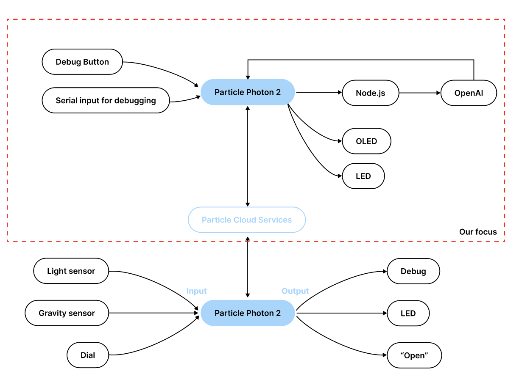

# Week 13: Complete the final project...
### Week of 12/05/2024

### Reflection:
This week, we continued to refine our project on detecting lower face expressions using a flex sensor placed on the neck. Our motivation remains focused on addressing challenges in at-home facial rehabilitation exercises for conditions like facial palsy, Parkinson's disease, and post-stroke recovery. We aim to replace camera-based systems with a non-CV (computer vision) approach that is more comfortable and practical for long-term use.

Our progress so far includes:

Iteration 1: Successfully demonstrated the feasibility of using a flex sensor for detecting facial expressions.
Iteration 2: Collected and manually labeled sensor data into three categories (no expression, smile, open mouth) and trained a CNN model with promising results.
Iteration 3: Attempted to integrate video-based CV landmarks with sensor data but encountered issues with model reliability and balance.
Iteration 4: Currently developing a hybrid approach, combining rule-based models for interpreting facial expressions and CNNs for refining predictions.

### Speculation:
Moving forward, we aim to:

1. Complete Iteration 4 and validate its efficacy with larger datasets.
2. Explore more complex facial motions such as tongue movement and deep breathing to expand the model's versatility.
3. Incorporate gamification and usability enhancements to ensure engagement and accessibility for patients.
4. Seek professional feedback from medical practitioners for further validation and optimization.

Challenges Addressed:

1. Limited range of detectable expressions in existing wearable solutions.
2. Unsuitability of current wearable devices for long-term use due to complex setups or discomfort.

Here is a face landmark that we generate from image


Here is the system diagram for the final project.


---


# Week 12: Develop details about the final project...
### Week of 11/28/2024

### Reflection:
The second week was dedicated to fleshing out the technical and research details of the project. We outlined a multi-stage plan, starting with data collection for two basic motions: smiling and opening the mouth. I worked on organizing how the collected data would be cleaned, visualized, and split into training and testing sets for ML models. The introduction of CNN (Convolutional Neural Networks) for motion classification showed promise for achieving high accuracy in detecting subtle patterns. Additionally, the integration of the flex sensor's outputs with real-time visual feedback laid the groundwork for the project's technical feasibility. We also began considering the game mechanics, brainstorming how patients could interact with the system in an enjoyable and productive way.

### Speculation:
As we move forward, fabricating a prototype to test real-time data classification will be essential. If successful, the next phase will involve scaling the data collection to more complex motions, such as tongue movement or deep breathing, and refining the ML model. Simultaneously, the game design must evolve to ensure usability and accessibility for patients with different levels of mobility. Exploring partnerships with medical professionals to validate the rehabilitation effectiveness and usability of the game could further enhance the project's impact and credibility.

Here is our system diagram.


Here is some photos when we do experiment about the fabrication.


---

# Week 11: Starting to think about the final project...
### Week of 11/14/2024
### Reflection:
The first week focused on ideation and brainstorming for a novel application of technology to assist with rehabilitation. The concept of detecting lower face expressions using a flex sensor on the neck emerged as a promising direction. This idea addresses a clear need: helping patients with facial paralysis, swallowing difficulties, or cervical-related conditions complete their rehabilitation exercises effectively. By exploring the interplay of motion detection, machine learning, and gamification, I realized the potential for a system that is not only functional but also engaging for patients. Collaborating with teammates enabled us to refine this concept and identify the primary challenges and opportunities, such as motion classification accuracy and user engagement through game design.


### Speculation:
Building on the brainstorming session, I foresee the next steps involving detailed planning and resource identification. We will need to validate whether flex sensors can reliably detect subtle neck movements associated with facial expressions. Additionally, expanding the concept to include a fun and motivating game interface could be critical for ensuring patient adherence. Exploring other potential motions for data collection, such as tongue movements or breathing patterns, could also enhance the system's utility.

A short introduction & diagram about our project.


The first try with the sensor.


---
# Week 10: Project 3 Completed!
### Week of 11/7/2024
Reflection:
In this iteration, the project reached its final form with The Bard’s Canvas, a platform that generates Shakespearean-style poems and visualizes them as oil paintings. By incorporating a knowledge base of Shakespeare’s works, the system achieved a higher degree of thematic and stylistic alignment. The retrieval and reconstruction of poetic elements demonstrated the power of context-aware AI, while the use of the poems as prompts for DALL-E brought a new dimension to the outputs.

This iteration emphasized the creative potential of combining language and visual models, offering users a seamless way to explore art and literature. It also showcased the value of AI as a tool for bridging cultural history and modern technology, creating outputs that feel both familiar and novel.

Speculation:
Looking ahead, this approach could be expanded to include more diverse artistic and literary traditions, making the platform a cultural exploration tool. Incorporating interactive elements, such as allowing users to refine the poem or painting iteratively, could further personalize the experience. Moreover, integrating advanced retrieval mechanisms, such as semantic search across larger knowledge bases, could unlock even more nuanced and sophisticated outputs, paving the way for richer AI-human collaborations.

Here are the outputs and a system diagram of the final outcome.


---
# Week 9: Start of Project 3!
### Week of 10/31/2024
### Reflection:
This week marked my first experience with Zerowidth, exploring no-code approaches to creating and utilizing LLMs. Investigating its design for non-programmers provided insights into accessibility and usability in AI tools. The experiments allowed me to assess how such platforms democratize AI development by lowering technical barriers.
This week focused on the foundational stages of the project, exploring three distinct iterations to build a robust understanding of how LLMs interact with instructions and knowledge bases. The first iteration, a basic input-output setup with adjustable temperature, provided insights into how parameters like randomness affect the model's creativity and consistency. The second iteration introduced system instructions to guide the LLM’s responses, demonstrating the importance of clear and specific instructions in shaping outputs. The third iteration integrated a knowledge base, allowing the system to retrieve contextual information, which significantly enhanced the relevance and specificity of responses.

These experiments deepened my understanding of how knowledge design and instruction framing influence AI behavior. They also highlighted challenges, such as balancing the granularity of knowledge base chunking to ensure relevant retrieval without overwhelming the model with extraneous information.

### Speculation:
Building on these initial iterations, future improvements could involve experimenting with more sophisticated chunking methods, such as hierarchical organization or semantic clustering of the knowledge base. Additionally, exploring multi-turn interactions within these setups might unlock more dynamic and conversational outputs, making the system more interactive and adaptable to user queries.

Below is a diagram about the most basic system.


below is a diagram about a more complicated system.


Below is a picture I generated from Dall.E module in Zerowidth.


---


# Week 8：Rescue my photon from SOS mode
### Week of 10/24/2024

This week I'm continue to work on my photon project.
My photon suddenly went into SOS mode without any change of code.

After debugging, I found the issue lies on:
1. the soldering of OLED with photon is very unstable, it causes my photon to complaining about no OLED detected. To make it more stable, use I2C extend board.
2. there is one line of code when no OLED is detected that will cause the photon to enter SOS mode.

Below is a review about the overall system

```
for (;;); // Don't proceed, loop forever
```
### Reflection:
Debugging the Photon this week presented a critical learning moment. Diagnosing issues with OLED soldering and the infinite loop error highlighted the importance of both hardware stability and fail-safe coding practices. The hands-on experience taught me the value of iterative problem-solving and patience.

### Speculation:
With these challenges addressed, I can now focus on optimizing my Photon projects for reliability. Incorporating better soldering techniques or modular designs could minimize hardware issues, while refining error handling in code will ensure robust systems. This groundwork will be invaluable for scaling up future projects.


The complete code is here
```
#include "application.h"
#include "HttpClient.h"
#include "Particle.h"
#include "Adafruit_SSD1306.h"
#include "Adafruit_GFX.h"
#include "splash.h" //this is our custom header containing the splash screen bitmap
#include <String.h> 

SYSTEM_THREAD(ENABLED);

#define SCREEN_WIDTH 128 // OLED display width, in pixels
#define SCREEN_HEIGHT 64 // OLED display height, in pixels
#define SCREEN_ADDRESS 0x3D // OLED display address (for the 128x64)
#define POT_PIN A0 // Potentiometer is connected to A0

// Instantiate SSD1306 driver display object via I2C interface; note that no reset is used
Adafruit_SSD1306 disp(SCREEN_WIDTH, SCREEN_HEIGHT, &Wire, -1);

void http_connect(void);
void draw_splash(void); //our splash screen function
void draw_potval(String x); // display function
void adviceTypeHandler(const char *event, const char *data);
int potval = 0;
int adviceType = 1;


HttpClient http;
http_request_t request;
http_response_t response;
http_header_t headers[] = {
   { "Content-Type", "application/json" },
   { "Accept", "application/json" },
   { NULL, NULL } // terminator for headers
};

const char* serverName = "10.41.238.166" ; // Replace with your server IP or URL "10.41.236.23"
int buttonPin = D7; // The button pin
bool buttonPressed = false;
const char* answer = " ";


void setup(){
  Serial.begin(9600);
  pinMode(buttonPin, INPUT_PULLUP); // Button setup
  delay(8); 
  // if initialization fails print failure to Serial, and enter an infinite loop
  bool test_access = disp.begin(SSD1306_SWITCHCAPVCC, SCREEN_ADDRESS);


  if(!test_access){
    Serial.println(F("SSD1306 allocation failed"));
  }else{
    Serial.println("SSD1306 allocation success");
    draw_splash();
    delay(2000);
  }

  

}

void loop(){
  //
  if (digitalRead(buttonPin) == LOW) {
    if (!buttonPressed) {
      buttonPressed = true;
      Serial.println("button pressed");
      adviceType = 2; // fill subscribe
      http_connect();
    }
  } 
  else {
      buttonPressed = false;
  }

  //add in communication code
  Particle.subscribe("adviceTypeUpdate", adviceTypeHandler, ALL_DEVICES);

  delay(100);
}

void adviceTypeHandler(const char *event, const char *data) {
    String adviceTypeReceived = data;  // Store received advice type
    Serial.println("Received Advice Type: " + adviceTypeReceived);  // Log it
}

void http_connect(void){

  if (WiFi.ready()){
    // Set the HTTP request URL
    request.hostname = serverName;
    request.port = 3000;
    request.path = "/generate?type="+String(adviceType);

    // Send the request
    http.get(request, response, headers);

    // Output the response to the serial monitor
    Serial.println("Response from GPT API:");

    if (response.status == 200) {
      Serial.println(response.body);
      draw_potval(response.body);

    } else {
      Serial.println("HTTP request failed.");
    }


  }else {
    Serial.println("WiFi not ready.");
  }
  
}

void draw_splash(void){
  disp.clearDisplay();
  disp.drawBitmap(0, 0, epd_pirate_small, SCREEN_WIDTH, SCREEN_HEIGHT, WHITE);
  disp.display();
}

void draw_potval(String x){
  disp.clearDisplay();
  disp.setTextSize(1);
  disp.setTextColor(WHITE);
  disp.setCursor(0,0);
  disp.printf(x);
  disp.display();
}

```

---

# Week 7：GPT API + Nodejs + photon
### Week of 10/17/2024


### Reflection:
Combining GPT API with Photon and Node.js was a significant leap in exploring AI-driven interactions. Setting up a local server and handling JSON requests allowed me to connect AI-generated advice with physical output on an OLED. The teamwork involved also highlighted the value of collaboration and shared expertise in solving challenges.

This week I'm working on the team project. We are making an answer book that generate random advice for the person who opening the book. 
I have rich experience about microprocessor, so I'm helping out my teammates on basic sensor problems.
As for myself, I have mainly discovered about how to use call chatgpt API via node js and display the output to OLED.

This is th overall architecture of the system.

This is one of my captures when I tried out photon.

I firstly wrote a **server.js** code to setup a local server. This piece of code runs a local server at localhost:3000.
I used the **express** library to handle the app, and I used **https** library to handle request and response.
Then I wrote a json message about generating an advice, and feed it to chatgpt. 
Then the output from chatgpt should be stored in **responseData**
There is also an **if else** statement to handle any error and display the error in terminal.

### Speculation:
This integration opens up possibilities for interactive systems that merge AI capabilities with tangible user interfaces. Future iterations could include real-time feedback loops or additional sensors to create personalized and adaptive advice systems, expanding applications in education or mental health support.

```
const apiKey = 'MY API KEY';
const https = require('https');
const express = require('express');
const app = express();
const port = 3000;

app.get('/generate', (req, res) => {
  const prompt = "Generate a short advice";

  const data = JSON.stringify({
    model: "gpt-4o-mini",
    messages: [
      {
        role: "system",
        content: "You are an assistant that speaks random advice abour career. Be mysterious"
      },
      {
        role: "user",
        content: [
          {
            type: "text",
            text: prompt
          }
        ]
      }
    ],
    max_tokens: 20
  });

  const options = {
    hostname: 'api.openai.com',
    path: '/v1/chat/completions',
    method: 'POST',
    headers: {
      'Authorization': `Bearer ${apiKey}`,
      'Content-Type': 'application/json',
      'Content-Length': data.length
    }
  };

  const request = https.request(options, (response) => {
    let responseData = '';

    response.on('data', (chunk) => {
      responseData += chunk;
    });

    response.on('end', () => {
      const result = JSON.parse(responseData);
      res.send(result.choices[0].message.content.trim());
      //res.send("Test response from server");
    });
  });

  request.on('error', (error) => {
    console.error(error);
    res.status(500).send('Error generating text');
  });

  request.write(data);
  request.end();
});

app.listen(port, () => {
  console.log(`Server listening at http://localhost:${port}`);
});
```

Then I wrote a cpp code for my photon. When I press the button, the photon would prompt my message to chatgpt. And the output from gpt would be displayed on OLED.
```
#include "application.h"
#include "../lib/HttpClient/src/HttpClient/HttpClient.h"
#include "Particle.h"
#include "Adafruit_SSD1306.h"
#include "Adafruit_GFX.h"
#include "splash.h"

SYSTEM_THREAD(ENABLED);

#define SCREEN_WIDTH 128 // OLED display width, in pixels
#define SCREEN_HEIGHT 64 // OLED display height, in pixels
#define SCREEN_ADDRESS 0x3D // OLED display address (for the 128x64)

Adafruit_SSD1306 disp(SCREEN_WIDTH, SCREEN_HEIGHT, &Wire, -1);

void draw_splash(void); //our splash screen function
void draw_potval(void); //our potentiometer value display function
void draw_bitmap(const unsigned char* bitmap, int x, int y, int w, int h, int color);
int potval = 0;

HttpClient http;
http_request_t request;
http_response_t response;
http_header_t headers[] = {
    { "Content-Type", "application/json" },
    { "Accept", "application/json" },
    { NULL, NULL } // terminator for headers
};

const char* serverName = "10.41.236.23"; // Replace with your server IP or URL
int buttonPin = D7; // The button pin
bool buttonPressed = false;

void setup() {
  Serial.begin(9600);
  pinMode(buttonPin, INPUT_PULLUP); // Button setup

  //oled setup
  delay(8);
  bool test_access = disp.begin(SSD1306_SWITCHCAPVCC, SCREEN_ADDRESS);
  if(!test_access){
    Serial.println(F("SSD1306 allocation failed"));
    for (;;); // Don't proceed, loop forever
  }else{
    Serial.println("SSD1306 allocation success");
    draw_splash();
    delay(2000);
  }
}

void loop() {
  if (digitalRead(buttonPin) == LOW) {
    if (!buttonPressed) {
      buttonPressed = true;

      // Set the HTTP request URL
      request.hostname = serverName;
      request.port = 3000;
      request.path = "/generate";

      // Send the request
      http.get(request, response, headers);

      // Output the response to the serial monitor
      Serial.println("Response from GPT API:");
      Serial.println(response.status);
      Serial.println(response.body);

      //display this on OLED screen
      draw_potval();
      

    }
  } 
  else {
      buttonPressed = false;
  }
  delay(100);
}


void draw_splash(void){
  disp.clearDisplay();
  disp.drawBitmap(0, 0, epd_pirate_small, SCREEN_WIDTH, SCREEN_HEIGHT, WHITE);
  disp.display();
}

void draw_potval(){
  disp.clearDisplay();
  disp.setTextSize(1);
  disp.setTextColor(WHITE);
  disp.setCursor(0,0);
  disp.printf(response.body);
  disp.display();
}
```

---

# Week 6: Use Photon with accelerometer and gyroscope
### Week of 10/10/2024

### Reflection:
This week, I explored integrating the Photon with an accelerometer and gyroscope. The process of handling large accelerometer values and implementing data smoothing techniques was particularly rewarding. Writing functions like constrain() and map() to normalize data taught me the importance of preparing sensor outputs for real-world applications.

This week I have explored to use photon + accelerometer and gyroscope

1. The accelerometer's values are quite big, so I tried to use constrain() function to remove the extreme values, and use map() function to remap the value to a smaller range

2. I also tried to smooth out the accelerometer values.
   Firstly, I defined 3 arraies with a length of 10 to contain accelerometer outputs.

   Secondly, I worte a function to calculate average value of number in an array.

   Thirdly, I update the numbers in the array in the loop()
   Finally, I used my function calculateAverage() to calculate the smooth values.


### Speculation:

This project could evolve into motion-detection systems or wearable devices that track activity or posture. Further optimization, such as using machine learning to interpret motion patterns, could unlock new applications in fields like fitness tracking or healthcare monitoring.
---

# Week 5: Explore about Photon #
### Week of 10/03/2024

This week I mainly explored about photon.

Reflection:
My exploration of the Photon this week introduced both technical challenges and learning opportunities. I encountered common setup issues like device recognition on Windows and serial port visibility, which I resolved with assistance. These hurdles reinforced my troubleshooting skills. Additionally, experimenting with tutorials deepened my understanding of the Photon’s capabilities, such as using sensors and cloud-based functions.

I encountered a bunch of issues in setting up the photon with my laptop, basiclly problems like my windows device cannot recognise my photon, my serial port does not appears in the UI after I plugged in my photon. These problems are common when setting up a new microprocesser with PC and I solved these problems with the help of Roopa.

I also tried about 3 tutorials, here are some photos:
1. The flash rate of the LED with change with the button
2. The fsr sensor
3. The publish to cloud function


Speculation:
As I continue to explore the Photon, I see potential in applying it to IoT projects, such as environmental monitoring or smart home devices. Expanding my knowledge of its communication protocols and integrating it with other sensors could enable more complex and functional prototypes.

---

# Week 4: A network map of a pet camera system #
### Week of 09/26/2024

Reflection:
This week, I delved into the intricacies of designing a network map for a pet camera system. The exercise gave me insight into the interplay between hardware and software, especially the connections between the app and the camera. It enhanced my understanding of how user interactions are translated into technical functionalities. Additionally, visualizing this system as a network map highlighted areas for optimization, such as streamlining communication protocols or enhancing user accessibility.

Speculation:
Moving forward, I foresee opportunities to expand the project by incorporating advanced functionalities like motion detection or integration with smart home systems. Exploring data encryption for secure video streaming could also become a valuable focus area to ensure user privacy.


---

# Week 3: Create my own phone stand with Grasshopper!! #
### Week of 09/19/2024

## Summary

This week I used Grasshopper to created my own phone stand. And I used Prusa printer to printed it out! HORAYYYYY!

## Problems I found for the original design
The stand is too shallow, causing my phone to slip back and forth, but making the saddle deeper is not an option, as it would obstruct the phone’s screen. And the stand does not provide adequate support for my iPad.

## Working process


This is what I have made for for the new stand. 
1.	I added a support column on the top of the stand to support larger devices like ipad.
2.	I used a solid base instead of a shallow base to lower the center of the gravity.
3.	I added a cut through in front, so that less view would be blocked.
---

# Week 2: Modelling a phone stand with Grasshopper #
### Week of 09/12/2024

## Summary

This week I explored on how to use Rhino and Grasshopper to edit models.


## A flow diagram about how to make a phone stand.

This flow diagram is a demonstration about how to make a simple phone stand with basic shapes like sphere and rectangle.


## Manipulate parameters and bake some intermediate states

Upon opening the file, I firstly tried to toggle some buttons to see if there is any change to the model. \
With the display phone button turned off, the phone model disappeared. From this button, I understood the meaning of  **"Filter"**. \


Then I baked some intermediate state models to get some visualizations about what going on in these steps.\
For example, I baked the following node and knew the substraction result of the two spheres.


## Generating my own phone stand with cylinders

Then I generated my own model with cylinders. 

To do this, firstly, I created two cylinders with two scalar numbers as radius and height, as well as y-axis as the direction. Then, I substracted these two cylinders with a box under xy plane to ensure that the part under xy plane is eliminated. After that, I substracted the two cylinders to get a shell. In the end, I substracted the phone with phone stand.

However, I found that I cannot get **a enclosed shape** for the phone stand.


Then, I tried to substract again with another box on the top of the cylinders and finally I got an enclosed shape.


This is my baked image.  :grinning:


---
Oh after Monday class, I knew that the cylinder can be enclosed with a "Cap" node.   :grinning:

---


# Week 1: Everthing starts here #
## Week of 09/05/2024

This week, I explored the github and rhino. I am total new to Rhino, so I watched some Youtube tutorials.

The following series is very useful for me as it explained from the very beginning and in a suitable pace.


---

I also explored how to add emojis in github

https://github.com/ikatyang/emoji-cheat-sheet/blob/master/README.md#smileys--emotion

:grinning:
